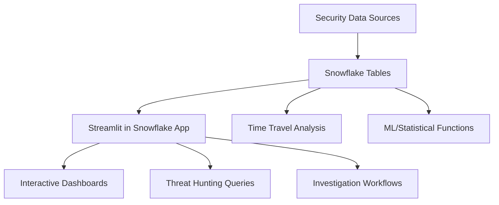

# 🛡️ CyberCommand
## Streamlit in Snowflake Cybersecurity & SIEM Demo Application

A comprehensive threat hunting and security analytics platform built as a **Streamlit in Snowflake (SiS)** application, demonstrating Snowflake's native application capabilities for cybersecurity data analysis.

## ✨ Features

### 🔍 Interactive Threat Hunting
- **Scenario-based hunting** with pre-built detection techniques
- **Custom SQL query builder** with threat hunting templates
- **Real-time analytics** with advanced visualizations
- **Historical analysis** using Snowflake's Time Travel feature
- **Investigation workflows** with collaborative features

### 📊 Advanced Security Analytics
- **Multi-dimensional dashboards** for security metrics
- **User behavior analytics** with anomaly detection
- **Network traffic analysis** with geographic insights
- **Threat intelligence correlation** with IOC matching
- **Compliance reporting** with audit trails

### 🎯 Pre-built Hunting Scenarios
- **"The Phantom Exfiltrator"**: APT data theft detection
- **"Impossible Travel"**: Geographic anomaly detection
- **"Lateral Movement"**: Internal network reconnaissance
- **"Privilege Escalation"**: Unauthorized access patterns
- **"Command & Control"**: C2 communication detection

### 🛡️ Data Sources
- Network traffic logs with full packet metadata
- Authentication and access logs with geolocation
- Endpoint security events with process details
- Threat intelligence feeds with confidence scoring
- Cloud security logs (AWS, Azure, GCP)

## 🏗️ Project Structure

```
cyber_app/
├── streamlit_app.py              # Main SiS application
├── pages/                        # Multi-page application
│   ├── 1_🔍_Threat_Hunting.py   # Advanced hunting interface
│   └── 2_📊_Analytics.py         # Security analytics dashboard
├── .streamlit/
│   └── secrets.toml              # Snowflake connection config
├── environment.yml               # SiS environment dependencies
├── database/
│   ├── schema/                   # Snowflake table definitions
│   └── seeds/                    # Sample queries and views
├── data-generation/              # Realistic data generation
│   ├── generators/               # Log generators with threat scenarios
│   ├── config/                   # Generation parameters
│   └── generate_security_data.py # Main generation script
├── snowflake_setup.sql           # SiS deployment setup
├── deploy.sql                    # File upload and deployment
└── requirements.txt              # Python dependencies
```

## 🚀 Complete Setup Guide

Follow these detailed instructions to deploy CyberCommand in your Snowflake environment.

### **Prerequisites**
- Snowflake account with ACCOUNTADMIN privileges
- Access to Snowsight (Snowflake's web interface)
- Files from this project accessible locally

---

### **Step 1: Initial Snowflake Environment Setup**

1. **Open Snowsight and Create Worksheet**
   - Go to your Snowflake account: `https://<your-account>.snowflakecomputing.com`
   - Click **"Worksheets"** → **"+ Worksheet"**
   - Name it: `CyberCommand Setup`

2. **Run Initial Setup**
   Copy and paste this block into your worksheet:

```sql
-- Switch to ACCOUNTADMIN role
USE ROLE ACCOUNTADMIN;

-- Create database, schema, and warehouse
CREATE OR REPLACE DATABASE cyber_command;
USE DATABASE cyber_command;
CREATE OR REPLACE SCHEMA security_logs;
USE SCHEMA security_logs;

CREATE OR REPLACE WAREHOUSE cybercommand_wh
    WAREHOUSE_SIZE = 'MEDIUM'
    AUTO_SUSPEND = 300
    AUTO_RESUME = TRUE;

-- Create roles and grant permissions
CREATE OR REPLACE ROLE cybercommand_admin;
GRANT USAGE ON WAREHOUSE cybercommand_wh TO ROLE cybercommand_admin;
GRANT USAGE ON DATABASE cyber_command TO ROLE cybercommand_admin;
GRANT USAGE ON SCHEMA cyber_command.security_logs TO ROLE cybercommand_admin;
GRANT CREATE TABLE ON SCHEMA cyber_command.security_logs TO ROLE cybercommand_admin;
GRANT CREATE VIEW ON SCHEMA cyber_command.security_logs TO ROLE cybercommand_admin;
GRANT CREATE STREAMLIT ON SCHEMA cyber_command.security_logs TO ROLE cybercommand_admin;
GRANT ROLE cybercommand_admin TO USER CURRENT_USER();

-- Switch to new role
USE ROLE cybercommand_admin;
USE WAREHOUSE cybercommand_wh;

SELECT 'Setup completed successfully!' as status;
```

---

### **Step 2: Create Database Schema**

1. **Create New Worksheet** named `CyberCommand Schema`
2. **Set Context:**
```sql
USE ROLE cybercommand_admin;
USE WAREHOUSE cybercommand_wh;
USE DATABASE cyber_command;
USE SCHEMA security_logs;
```

3. **Copy and Execute Schema File**
   - Open `database/schema/create_tables.sql`
   - Copy **entire contents** into worksheet
   - Execute the script

4. **Verify Tables Created:**
```sql
SHOW TABLES;
```
   *Expected: 10+ tables including NETWORK_LOGS, AUTH_LOGS, THREAT_INTEL, etc.*

---

### **Step 3: Create Data Generation Procedures**

1. **Create New Worksheet** named `CyberCommand Data Generation`
2. **Set Context** (same as Step 2)
3. **Copy and Execute Data Generation File**
   - Open `database/data_generation.sql`
   - Copy **entire contents** into worksheet
   - Execute the script

4. **Verify Procedures Created:**
```sql
SHOW PROCEDURES;
```
   *Expected: 7+ procedures including GENERATE_ALL_DEMO_DATA*

---

### **Step 4: Generate Sample Data**

1. **Scale Up Warehouse:**
```sql
ALTER WAREHOUSE cybercommand_wh SET WAREHOUSE_SIZE = 'LARGE';
```

2. **Generate Demo Dataset:**
```sql
-- This takes 2-3 minutes to generate 450K+ events
CALL generate_all_demo_data(
    30,     -- 30 days of data
    10000,  -- 10K network events/day
    5000    -- 5K auth events/day
);
```

3. **Verify Data Generation:**
```sql
SELECT 'network_logs' as table, COUNT(*) as records FROM network_logs
UNION ALL
SELECT 'auth_logs' as table, COUNT(*) as records FROM auth_logs  
UNION ALL
SELECT 'users' as table, COUNT(*) as records FROM users;
```
   *Expected: ~300K network logs, ~150K auth logs, ~150 users*

4. **Scale Down Warehouse:**
```sql
ALTER WAREHOUSE cybercommand_wh SET WAREHOUSE_SIZE = 'MEDIUM';
```

---

### **Step 5: Deploy Streamlit Application**

1. **Create Stage:**
```sql
CREATE OR REPLACE STAGE streamlit_stage
    DIRECTORY = (ENABLE = TRUE);
```

2. **Upload Files** (Choose Option A or B):

   **Option A: Using SnowSQL**
   ```bash
   snowsql -a <account> -u <username>
   
   USE ROLE cybercommand_admin;
   USE DATABASE cyber_command;
   USE SCHEMA security_logs;
   
   PUT file://streamlit_app.py @streamlit_stage AUTO_COMPRESS=FALSE OVERWRITE=TRUE;
   PUT file://pages/1_🔍_Threat_Hunting.py @streamlit_stage/pages/ AUTO_COMPRESS=FALSE OVERWRITE=TRUE;
   PUT file://pages/2_📊_Analytics.py @streamlit_stage/pages/ AUTO_COMPRESS=FALSE OVERWRITE=TRUE;
   PUT file://environment.yml @streamlit_stage AUTO_COMPRESS=FALSE OVERWRITE=TRUE;
   ```

   **Option B: Using Snowsight Interface**
   - Go to **Data** → **Databases** → **CYBER_COMMAND** → **SECURITY_LOGS** → **Stages** → **STREAMLIT_STAGE**
   - Click **"+ Files"** and upload each file

3. **Create Streamlit Application:**
```sql
CREATE OR REPLACE STREAMLIT cybercommand_app
    ROOT_LOCATION = '@cyber_command.security_logs.streamlit_stage'
    MAIN_FILE = '/streamlit_app.py'
    QUERY_WAREHOUSE = 'cybercommand_wh';
```

4. **Verify Creation:**
```sql
SHOW STREAMLITS;
SELECT system$get_streamlit_url('cybercommand_app') as app_url;
```

---

### **Step 6: Access Your Application**

1. **Launch Application:**
   - Go to **Streamlit** in Snowsight navigation
   - Click **"cybercommand_app"**

2. **Test Functionality:**
   - Verify dashboard shows metrics
   - Try **🔍 Threat Hunting** → **Data Exfiltration** scenario
   - Check that queries return data and visualizations work

---

### **✅ Success Checklist**

- [ ] Database and warehouse created
- [ ] All tables created (10+ tables)
- [ ] Data generation procedures created (7+ procedures)  
- [ ] Sample data generated (300K+ events)
- [ ] Streamlit application deployed
- [ ] Application accessible and functional

---

### **🆘 Troubleshooting**

**Permission Errors:**
```sql
USE ROLE ACCOUNTADMIN;
GRANT ROLE cybercommand_admin TO USER <your-username>;
```

**Slow Data Generation:**
```sql
ALTER WAREHOUSE cybercommand_wh SET WAREHOUSE_SIZE = 'X-LARGE';
```

**App Won't Start:**
```sql
LIST @streamlit_stage;  -- Check uploaded files
DESC STREAMLIT cybercommand_app;  -- Verify configuration
```

**Query Failures:**
```sql
GRANT SELECT ON ALL TABLES IN SCHEMA security_logs TO ROLE cybercommand_admin;
GRANT SELECT ON ALL VIEWS IN SCHEMA security_logs TO ROLE cybercommand_admin;
```

## 🎭 Demo Scenarios

### 🕵️ "The Phantom Exfiltrator"
**Advanced Persistent Threat (APT) Simulation**
- 45-day attack timeline with multiple phases
- Data exfiltration through legitimate-looking transfers
- Target users: Engineering and Finance departments
- Detection: Large file transfers, off-hours access, unusual destinations

### 🏢 "Insider Threat Detection"
**Malicious Employee Behavior Analysis**
- Employee planning to steal data before leaving
- After-hours system access patterns
- Bulk downloads of sensitive information
- Detection: Behavioral anomalies, unusual file access

### 🔗 "Supply Chain Compromise"
**Third-party Software Attack Simulation**
- Malicious code injection through software updates
- Network beaconing to C2 servers
- Process injection and registry modifications
- Detection: Unsigned binaries, suspicious network traffic

## 🚀 Snowflake Capabilities Demonstrated

### 📊 **Native Analytics Platform**
- **Streamlit in Snowflake**: No external infrastructure required
- **Instant scalability**: Auto-scaling compute resources
- **Real-time processing**: Sub-second query performance on TBs of data

### 🔍 **Advanced SQL Analytics**
- **Time Travel**: Historical investigation and forensic analysis
- **Semi-structured data**: Native JSON and VARIANT support
- **Window functions**: Advanced behavioral analysis
- **Geospatial analytics**: Location-based threat detection

### 🛡️ **Enterprise Security**
- **Role-based access control**: Fine-grained permissions
- **Data governance**: Column-level security and masking
- **Audit logging**: Complete activity tracking
- **Zero-copy cloning**: Isolated investigation environments

### 🤝 **Collaboration Features**
- **Secure data sharing**: Threat intelligence collaboration
- **Shared investigations**: Team-based hunting workflows
- **Real-time dashboards**: Live security monitoring
- **Export capabilities**: Integration with external tools

## 🔧 Technical Architecture

### **Streamlit in Snowflake Benefits**
- ✅ **No infrastructure management** - Runs natively in Snowflake
- ✅ **Direct data access** - No data movement or ETL required
- ✅ **Automatic scaling** - Handles any data volume
- ✅ **Built-in security** - Inherits Snowflake's security model
- ✅ **Cost-effective** - Pay only for compute used
- ✅ **Easy deployment** - Single-click deployment from Snowsight

### **Data Processing Pipeline**


## 🎯 Use Cases

### **Security Operations Centers (SOCs)**
- Real-time threat monitoring and alerting
- Incident response and investigation workflows
- Compliance reporting and audit trails
- Team collaboration and knowledge sharing

### **Threat Hunting Teams**
- Hypothesis-driven security investigations
- Behavioral analysis and anomaly detection
- Threat intelligence integration and correlation
- Historical analysis using Time Travel

### **Security Executives**
- Executive dashboards with security metrics
- Risk assessment and trending analysis
- Compliance status and governance reporting
- ROI demonstration for security investments

## 📚 Learning Outcomes

After exploring this demo, you'll understand:

1. **Snowflake's Data Platform**: How to leverage Snowflake for security analytics
2. **Streamlit in Snowflake**: Building interactive applications without infrastructure
3. **SQL for Security**: Advanced SQL techniques for threat detection
4. **Cybersecurity Concepts**: Common attack patterns and detection methods
5. **Data Visualization**: Creating compelling security dashboards

## 🤝 Contributing

We welcome contributions to enhance the CyberCommand demo:

- **New threat scenarios**: Add realistic attack simulations
- **Additional visualizations**: Enhance dashboard capabilities  
- **Query templates**: Contribute threat hunting queries
- **Documentation**: Improve setup and usage guides

## 📄 License

This project is licensed under the MIT License - see the LICENSE file for details.

## 🙏 Acknowledgments

- **Snowflake Security Team** for platform capabilities and guidance
- **MITRE ATT&CK Framework** for threat modeling references
- **Open source security community** for detection techniques and IOCs 